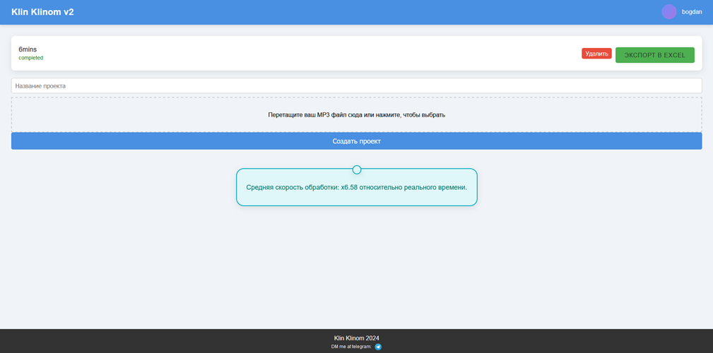
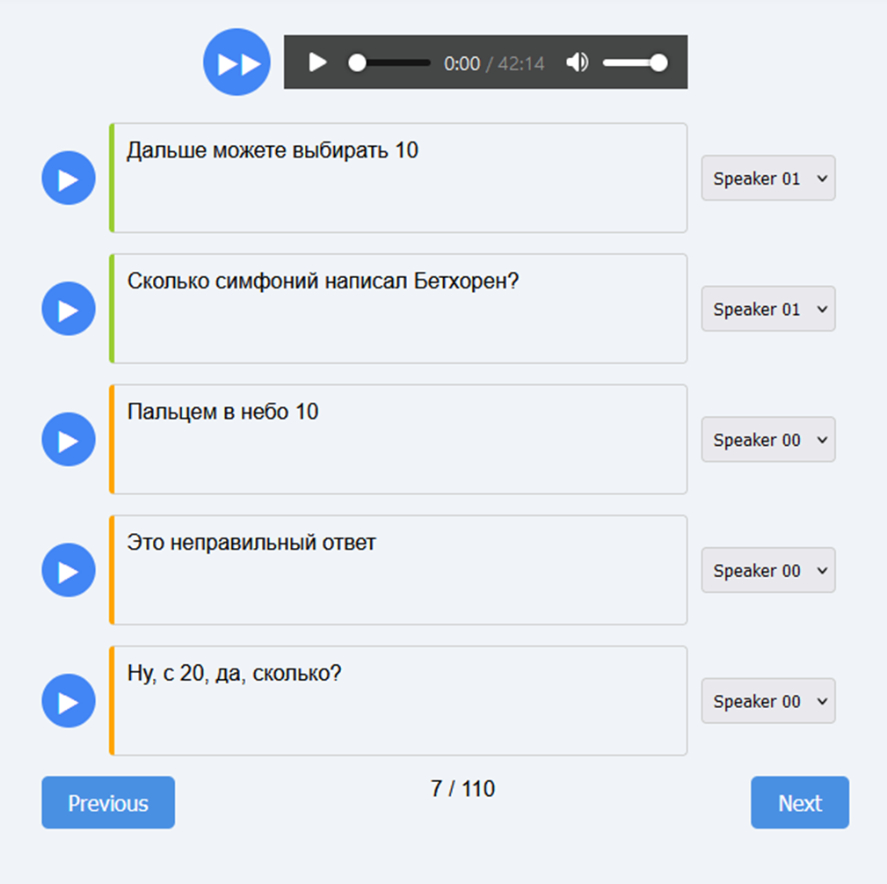

## О проекте
Это веб-приложение для автоматической транскрипции интервью. 
При помощи ИИ моделей выполняется распознование речи и разделение речи на говорящих. 
Результаты распознавания можно редактировать в браузере, а затем экспортировать в Excel. 

### Архитектура
Система состоит из двух частей:
1. Веб-приложение (Flask) - управляет веб интерфейсом, там логин, создание проекта, редактирование проекта. 
2. ML-сервис (Flask API) - отвечает за обработку аудио. 

ML-сервис использует две модели для обработки аудио:
1. **Whisper** превращает звук в текст и возвращает таймкоды
2. **Диаризация** (разделение говорящих) - определяет кто говорит на определенном таймкоде

### Технологии
* Python, Flask - для вебсайта
* Docker - только для ML-сервиса, для использования cuda. 
* HuggingFace, faster_whisper - модели
* SQLite - хранение пользователей и проектов
* javascript - редактор транскрипции
* ChatGPT - коллега

#### Панель управления проектами:

#### Редактор транскрипции
